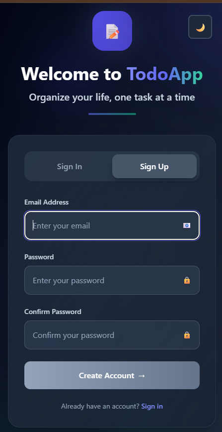

# 📝 Todo App - Application de Gestion de Tâches

Une application Todo moderne et complète avec authentification JWT, construite avec Node.js/Express (backend) et React/Vite (frontend).

!

## ✨ Fonctionnalités

### 🔐 Authentification Sécurisée

- **Inscription/Connexion** avec email et mot de passe
- **JWT (JSON Web Tokens)** pour l'authentification
- **Hachage bcrypt** des mots de passe (15rounds)
- **Sessions persistantes** avec localStorage

### ✅ CRUD Complet des Tâches
- **CREATE** : Ajouter de nouvelles tâches
- **READ** : Afficher toutes les tâches utilisateur
- **UPDATE** : Modifier le titre et marquer comme terminé/non terminé
- **DELETE** : Supprimer les tâches

### 🎨 Interface Utilisateur Moderne
- **Design responsive** (mobile-first 320px → 1440px)
- **Tailwind CSS** pour un styling moderne
- **Mode sombre/clair** avec détection système
- **Animations fluides** et transitions
- **États de chargement** et notifications toast

### 🚀 Performance et UX
- **Chargement rapide** avec Vite
- **Hot reload** en développement
- **Gestion d'erreurs** complète
- **Validation côté client et serveur**
- **API RESTful** bien structurée

## 🏗️ Architecture Technique

### Stack Technologique
```
Backend (Node.js):
├── Express.js 5.0       → Framework web rapide
├── SQLite3              → Base de données légère
├── JWT                  → Authentification stateless
├── bcrypt 6.0          → Hachage sécurisé
├── CORS                → Support cross-origin
└── Jest 30.2           → Tests unitaires

Frontend (React):
├── React 19.0          → Interface utilisateur moderne
├── Vite 5.4            → Build tool ultra-rapide
├── Tailwind CSS 3.4    → Framework CSS utilitaire
├── Fetch API           → Client HTTP natif
└── ES6+ Modules        → JavaScript moderne
```

### Structure du Projet
```
📁 Amna-TOdo/
├── 📁 server/                    # Backend API
│   ├── 📁 controllers/           # Logique métier
│   │   ├── authController.js     # Authentification
│   │   └── taskController.js     # Gestion tâches
│   ├── 📁 models/               # Modèles de données
│   │   ├── userModel.js         # Utilisateurs
│   │   └── taskModel.js         # Tâches
│   ├── 📁 routes/               # Routes API
│   │   ├── authRoutes.js        # /auth/*
│   │   └── taskRoutes.js        # /tasks/*
│   ├── 📁 middleware/           # Middlewares
│   │   └── requireAuth.js       # Protection JWT
│   ├── 📁 tests/                # Tests unitaires
│   ├── app.js                   # Point d'entrée
│   ├── db.js                    # Configuration DB
│   └── .env                     # Variables d'environnement
├── 📁 client/                   # Frontend React
│   ├── 📁 src/
│   │   ├── 📁 components/       # Composants réutilisables
│   │   │   ├── AuthCard.jsx     # Formulaire auth
│   │   │   └── TodoCard.jsx     # Carte tâche
│   │   ├── 📁 pages/            # Pages principales
│   │   │   ├── AuthPage.jsx     # Page connexion
│   │   │   └── TasksPage.jsx    # Page tâches
│   │   ├── 📁 controllers/      # Logique frontend
│   │   ├── 📁 models/           # Modèles locaux
│   │   ├── 📁 services/         # Services API
│   │   └── App.jsx              # Composant racine
│   ├── tailwind.config.js       # Config Tailwind
│   └── vite.config.js           # Config Vite
└── README.md                    # Documentation


## 📸 Screenshots:




```

## 🚀 Installation et Démarrage

### Prérequis
- **Node.js 22+** 
- **npm** ou **yarn**
- **Git**

### Installation Rapide

#### Option 1: Script Automatique (Recommandé)
```bash
# Cloner le projet
git clone <url-du-repo>
cd todo-app

# Lancer le script de démarrage automatique
# Windows:
start.bat

# Linux/Mac:
./start.sh
```

#### Option 2: Installation Manuelle

**1. Backend Setup**
```bash
cd server

# Installer les dépendances
npm install

# Configurer l'environnement
cp .env.example .env
# Éditer .env avec vos paramètres

# Démarrer le serveur
npm run dev
```

**2. Frontend Setup**
```bash
cd client

# Installer les dépendances
npm install

# Configurer l'environnement
cp .env.example .env

# Démarrer l'application
npm run dev
```

### Configuration

**server/.env**
```env
PORT=3000
JWT_SECRET=amna_secret_key
DB_FILE=./data.sqlite
NODE_ENV=development
```

**client/.env**
```env
VITE_API_URL=http://localhost:3000
```

## 🎯 Utilisation

### Accès à l'Application
- **Frontend** : http://localhost:5173
- **Backend API** : http://localhost:3000
- **Test API** : http://localhost:3000 → `{"ok":true}`

### Fonctionnalités Principales

#### 1. Authentification
- **Inscription** : Créer un compte avec email/mot de passe
- **Connexion** : Se connecter avec ses identifiants
- **Déconnexion** : Bouton de déconnexion sécurisée

#### 2. Gestion des Tâches
- **Ajouter** : Saisir une tâche et appuyer sur Entrée
- **Marquer terminé** : Cliquer sur la checkbox
- **Modifier** : Double-clic sur le texte ou bouton ✏️
- **Supprimer** : Bouton 🗑️ avec confirmation

#### 3. Interface
- **Responsive** : Fonctionne sur mobile, tablette, desktop
- **Mode sombre** : Basculement automatique ou manuel
- **Notifications** : Messages de succès/erreur
- **États de chargement** : Indicateurs visuels

## 📡 API Documentation

### Endpoints d'Authentification

**POST /auth/register**
```http
POST /auth/register
Content-Type: application/json

{
  "email": "user@example.com",
  "password": "motdepasse123"
}

Response: 201 Created
{
  "token": "eyJhbGciOiJIUzI1NiIs...",
  "user": {
    "id": 1,
    "email": "user@example.com"
  }
}
```

**POST /auth/login**
```http
POST /auth/login
Content-Type: application/json

{
  "email": "user@example.com",
  "password": "motdepasse123"
}

Response: 200 OK
{
  "token": "eyJhbGciOiJIUzI1NiIs...",
  "user": {
    "id": 1,
    "email": "user@example.com"
  }
}
```

### Endpoints des Tâches (Authentification requise)

**GET /tasks** - Lister les tâches
```http
GET /tasks
Authorization: Bearer <jwt_token>

Response: 200 OK
[
  {
    "id": 1,
    "title": "Ma première tâche",
    "completed": 0,
    "created_at": "2024-01-01T10:00:00.000Z"
  }
]
```

**POST /tasks** - Créer une tâche
```http
POST /tasks
Authorization: Bearer <jwt_token>
Content-Type: application/json

{
  "title": "Nouvelle tâche"
}

Response: 201 Created
{
  "id": 2,
  "title": "Nouvelle tâche",
  "completed": 0,
  "created_at": "2024-01-01T10:05:00.000Z"
}
```

**PUT /tasks/:id** - Modifier une tâche
```http
PUT /tasks/1
Authorization: Bearer <jwt_token>
Content-Type: application/json

{
  "title": "Tâche modifiée",
  "completed": true
}

Response: 200 OK
{
  "id": 1,
  "title": "Tâche modifiée",
  "completed": 1,
  "updated_at": "2024-01-01T10:10:00.000Z"
}
```

**DELETE /tasks/:id** - Supprimer une tâche
```http
DELETE /tasks/1
Authorization: Bearer <jwt_token>

Response: 204 No Content
```

## 🧪 Tests et Développement

### Lancer les Tests
```bash
# Tests backend
cd server
npm test                 # Tests complets avec coverage
npm run test:watch       # Mode watch pour développement

# Tests frontend (si configurés)
cd client
npm test
```

### Scripts de Développement
```bash
# Backend
npm run dev              # Serveur avec nodemon (auto-reload)
npm start               # Production
npm run test:coverage   # Coverage détaillé

# Frontend
npm run dev             # Serveur de développement Vite
npm run build           # Build de production
npm run preview         # Prévisualiser le build
```

### Débogage
```bash
# Backend avec logs détaillés
DEBUG=* npm run dev

# Debugger Node.js
node --inspect app.js
# Puis ouvrir chrome://inspect

# Base de données SQLite
sqlite3 server/data.sqlite
.tables
.schema
SELECT * FROM users;
SELECT * FROM tasks;
```

## 🔒 Sécurité

### Mesures Implémentées
- **JWT avec expiration** (15 min)
- **Hachage bcrypt** des mots de passe (8)
- **CORS configuré** pour le frontend
- **Validation des entrées** côté client et serveur
- **Protection contre l'injection SQL** (requêtes préparées)
- **Variables d'environnement** pour les secrets
- **Middleware d'authentification** sur les routes protégées

### Bonnes Pratiques
- Changer `JWT_SECRET` en production
- Utiliser HTTPS en production
- Configurer CORS strictement
- Logs d'audit des actions sensibles
- Rate limiting (à implémenter)

## 🚀 Déploiement

### Production Backend
```bash
cd server
npm install --production
NODE_ENV=production npm start
```

### Production Frontend
```bash
cd client
npm run build
# Servir le dossier dist/ avec nginx/apache
```

### Variables d'Environnement Production
```env
# Backend
NODE_ENV=production
PORT=3000
JWT_SECRET=<clé-super-sécurisée-longue>
DB_FILE=./data.sqlite

# Frontend
VITE_API_URL=https://votre-api.com
```


## 🛠️ Dépannage

### ⚡ Démarrage Rapide des Services

**Option 1: Script Automatique (Recommandé)**
```bash
# Double-cliquer sur le fichier ou exécuter :
start-dev.bat
```

**Option 2: Vérification de l'État**
```bash
# Vérifier si les services fonctionnent :
check-services.bat
```

**Option 3: Arrêt Propre**
```bash
# Arrêter tous les services :
stop-dev.bat
```


### 📋 Guide Complet de Dépannage

Pour des problèmes plus complexes, consultez : **[TROUBLESHOOTING.md](TROUBLESHOOTING.md)**

## 📈 Fonctionnalités Avancées

### Déjà Implémentées
- ✅ CRUD complet des tâches
- ✅ Authentification JWT sécurisée
- ✅ Interface responsive et moderne
- ✅ Mode sombre/clair
- ✅ Notifications toast
- ✅ États de chargement
- ✅ Validation des formulaires
- ✅ Tests unitaires backend
- ✅ Gestion d'erreurs complète


## 👨‍💻 Auteur

**Amna Todo App**
- 📧 Email: lakhalamna162@gmail.
- 🐙 GitHub: [@AmnaLakhaal](https://github.com/AmnaLakhal)
- 

---

